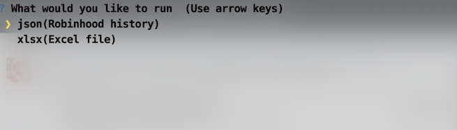

# robinhood-to-xlsx

## Environment

You are going to need / want to use
- Python - [I use 3.7.2](https://www.python.org/downloads/release/python-372/)
- pip (pip3 w/ python3)
- Virtualenv - [I use 16.4.3](https://virtualenv.pypa.io/en/latest/)

## Installation

After forking or cloning
#### unix
```
$ cd path/to/robinhood-to-xlsx
$ virtualenv venv
$ source venv/bin/activate
(venv) $ pip3 install -r requirements.txt
```
#### pc
```
$ cd path\to\robinhood-to-xlsx
$ virtualenv venv 
$ venv\scripts\activate
(venv) $ pip3 install -r requirements.txt
```

## Credentials file
Create `credentials.py` and copy this using the instructions below
```
# your credentials
username = "" # Your robinhood username or email
password = "" # Your robinhood password

# should also be generated, but needs to be found for now
device_id = "" # Your device id in the headers
```
- `(venv) $ touch credentials.py` - for unix users otherwise manually create the file
- Update `username="yourusername"`, `password="yourpassword"`
- Log in to robinhood and open up the inspector (`cmd+opt+i` on mac)
- Type `document.cookie` in the console and copy your `device_id`
- Update `device_id="your-device-id"` in `credentials.py`

## Running the app

`(venv) $ python3 app.py`

Two choices follow
- `json`
- `xlsx`



##### Getting your history - json
When you want to get the most up to date history, select `json` and then any of the selections from the checkboxes.
##### Generating excel files - xlsx
When you want to generate an excel file from the `json` you have stored, select `xlsx` and then any of the selections from the checkboxes.

You can press the space bar and select as many as you want. When you're ready, press enter to run.


## What's this for?
This will allow you to easily download your history from robinhood and export it to a xlsx file, all for easy viewing.

When exported, it will have aggregated data such as **total P/L**.

Of course, you will be able to amend the file to your liking afterwards as well. You can even adjust the controller files & settings.

## Database
I'm using sqlite3 which is a module included in the standard python library. There are 5 tables that are created in `robinhood.db`. Two of the tables hold `instruments` and `option_instruments`. When data is fetched, we store the data these instruments contain. They provide valuable data such as `strike_price` when looking at options. There is a also a `splits` table that we use to calculate **total P/L** on orders.

To prevent us from making unnecessary requests, we cache the data these instrument urls fetch and insert rows into our local DB. When we attempt to fetch our history multiple times, we instead fetch the instruments from `robinhood.db`.

If you wish to grab the most up to date instrument data, simply delete the respective tables or delete the `robinhood.db` file.

## Splits
As far as I can tell, Robinhood doesn't provide split information on stocks when buying and selling shares. Instead of adding an API to force people into using, I've created a dump of stock history on the top 100 stocks as of 09/20/2020, according to Robinhood. When pulling history from orders, it will automatically create the `splits` table and insert these rows. There's a file called `splits.sql` in the `sql` folder. You can add rows to this file for tickers I've missed. I could also add more in the future if requested.

Stock splits resulting in fractional shares don't get added to **total P/L**. I don't have access to the stock price on split at this time. I could work this in to a later version.

I'm aware of the endpoint that handles option contract splits and I haven't implemented it yet.

## Schemas
You can see all of the fields available to include, by looking in the `schema` folder and then the respective entity.

## Settings
The `settings.py` file contains what data the excel file will contain. For example, if you would like to include more information in the export to dividends, all you need to do is adjust `selected_keys_dividends`. Same goes for if you would like to remove a column.  You can also adjust the width of the columns by adjusting the width field for each respective dict.

## Formulas
After all of the rows get written, the formulas that are assigned in the respective files get executed. These are located in the `formulas` folder. Any other aggregate data that you would like to display will go here.

## Devices on your account
When using this app, your account's devices will update and look something like this.


## Contributing

- @kfchou - tons of testing and providing great datasets

Feel free to leave a pull request, or raise issues for any topic you may have.
